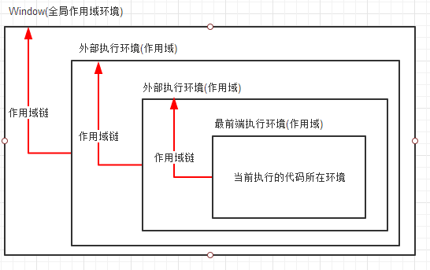

作用域
===

执行环境
---


每个函数运行时都会产生一个执行环境，定义了变量或函数有权能访问的其他数据，每个执行环境都有与之关联的一个`变量对象`(全局执行环境默认为window对象)

某个执行环境中的代码被执行完毕，该环境就会被销毁，保存在其中的变量和函数定义也会被随之销毁

作用域链
---
* 产生
  当代码在执行环境中执行时，会创建变量对象的一个作用域链；
* 作用
  保证对执行环境有权访问的所有函数和变量的有序访问

分类
----
### 全局作用域
* 定义
  最外层函数外的区域

### 函数作用域
* 定义
  函数内的区域

### 块级作用域
* 产生
  * 内层变量可能会覆盖外层变量；
  * 用来计数的循环变量泄露为全局变量；
* 是...
```js
  {}  块，let,const
```
this指向
---
* 产生
  * 是在运行时基于函数的执行环境绑定的；
* 指向
  * 全局函数中，this指向window对象（匿名函数具有全局性）；
  * 箭头函数中，
